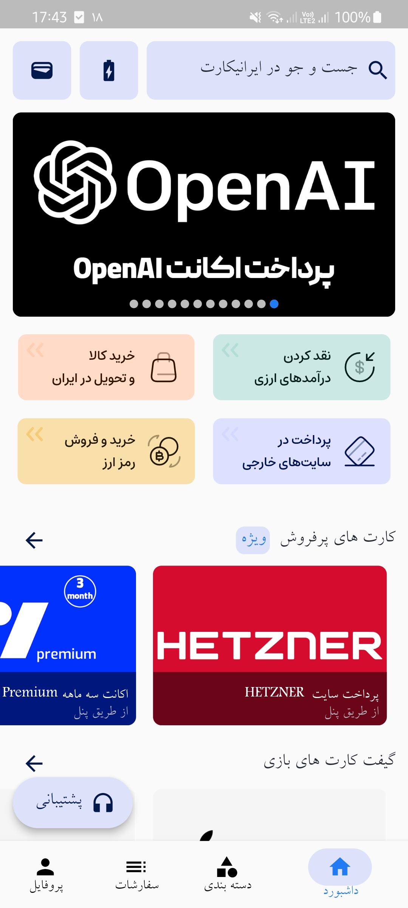
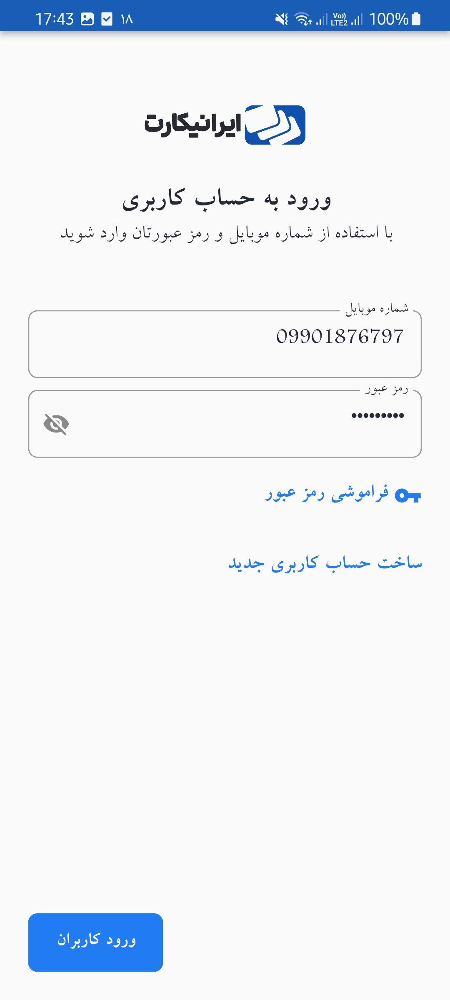
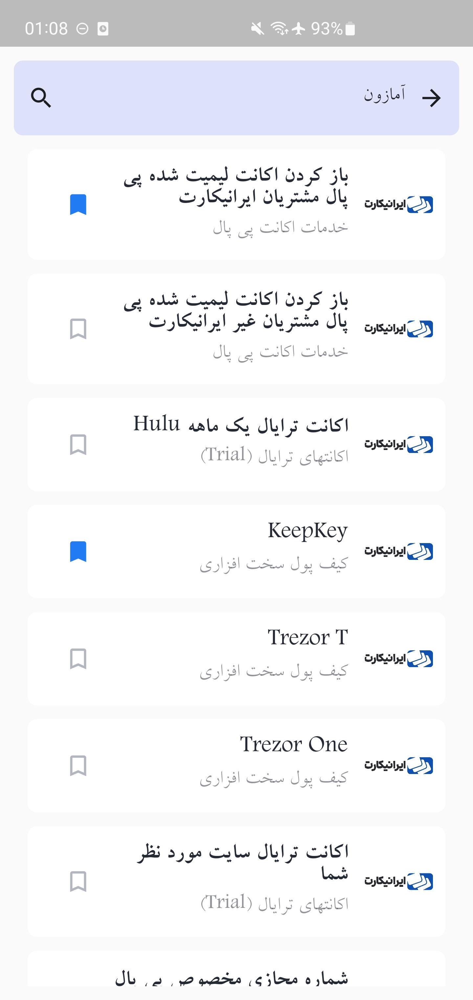

# iranicard_demo
A Sample Flutter Applicaion powered by iranicard API

https://api.iranicard.ir/api/

## Technologies & Architecture 

#### Technologies
* Flutter,Dart
* [cached_network_image](https://pub.dev/packages/cached_network_image)- Image loading and Caching
* [smooth_page_indicator](https://pub.dev/packages/smooth_page_indicator) - slider indicators
* [dio](https://pub.dev/packages/dio) - Remote Requests
* [hive_flutter](https://pub.dev/packages/hive_flutter)  - Local Database

#### Architecture
Block
* [flutter_bloc](https://pub.dev/packages/flutter_bloc) - bloc for state management
* [equatable](https://pub.dev/packages/equatable) - Simplify Equality Comparisons
* 
## Screenshots

### DashBoard

  

### Authentication

 

### Authentication

 

